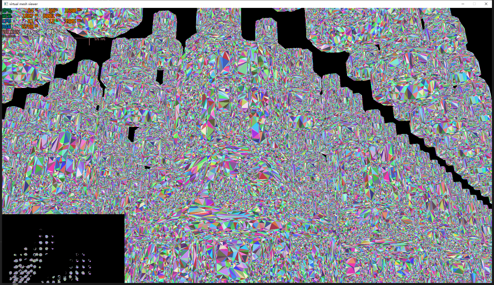
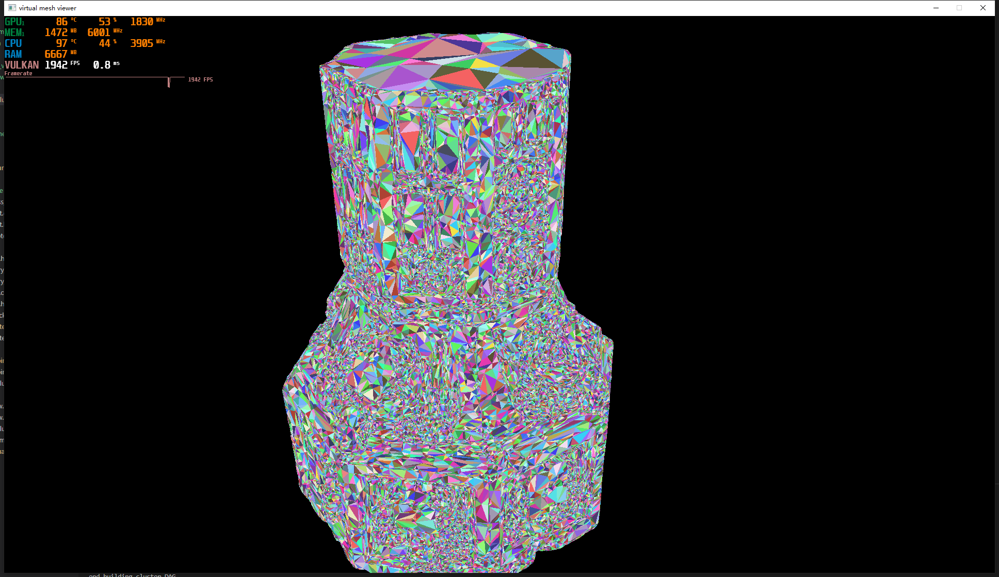
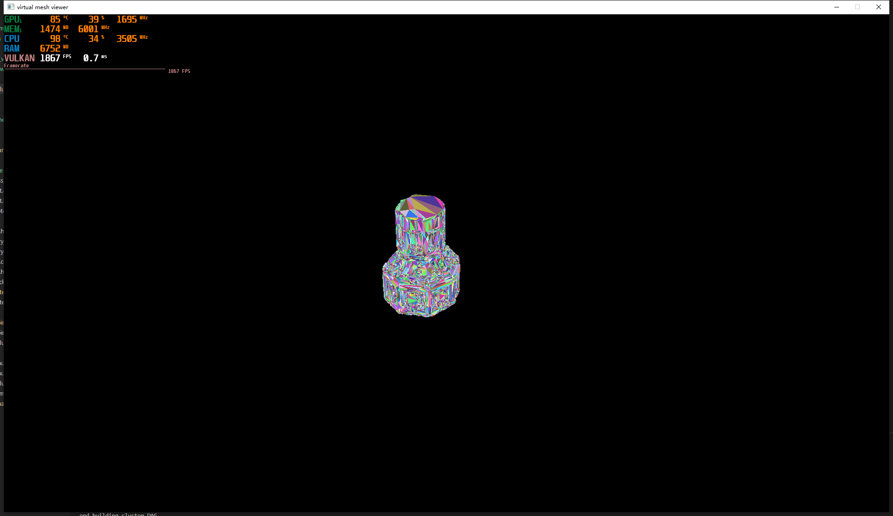
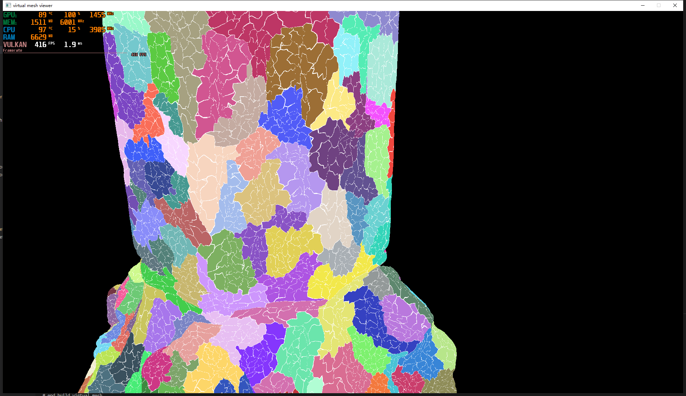

# learn-nanite

## upd 2023-4-23

### viewer

在lod_viewer基础上实现了视锥剔除与遮挡剔除（坑略多）
计算着色器启动时先根据group进行lod选择，group测试通过后再对cluster选择，可减少计算着色器启动的开销

在测试场景中，使用140w面的模型，900个实例，在运行时平均动态选择100w面进行渲染（最高200w面）
左下角的俯视图可看到剔除的部分

效果图

## upd 2023-4-13

#### lod_viewer

 通过计算着色器使用屏幕空间误差选择需要渲染的cluster，并填写indirect buffer间接绘制，以减少cpu与gpu间的同步与通信，实现运行时lod选择

w,a,s,d移动，j,k切换显示模式(triangle id、cluster id、group id、mip level)，长按b键显示鼠标

 

#### debug viewer

w,a,s,d移动，j,k切换显示模式(triangle id、cluster id、group id)

u,i切换mip_level，L显示cluster边界

## upd 2023-4-9

简单组织了一下文件结构

mesh文件夹：mesh头文件、qem网格简化、三角形分簇、簇的分组等

program文件夹：简单的viewer程序，用于debug显示，

vk、vk_win文件夹：vulkan与window的简单封装

用边哈希重新实现qem网格简化，可以处理重边与重点

实现三角形的分簇 (clustering triangles) 在cluster.h内

实现三角形簇的分组 (grouping clusters) 在cluster.h内

实现一个简易的viewer程序,在program/viewer内，

用w,a,s,d进行移动

j,k切换显示模式(triangle id、cluster id、group id)

u,i切换mip_level

长按b显示鼠标、移动鼠标转换镜头

## init
记录了我学习vulkan与nanite的仓库，现在为了赶春招十天写出来的，后面写完整后会写个博客

test是vulkan画三角形

test1是想用类似rendergraph的想法用json文件记录管线状态，方便使用，但怎么和代码交互还没想太明白，遂放弃，后面可能会去了解一下AMD开源的RenderPipelineShader

test2是一个简易的vulkan封装，主要是为了让调用写起来更好看点，（但封的过程还是得写vk原来丑丑的api）

test3是qem网格简化与vulkan窗口操作等，qem测试的模型有重点，没实现临近顶点的合并，会有破碎的情况

